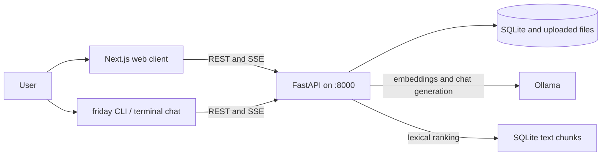
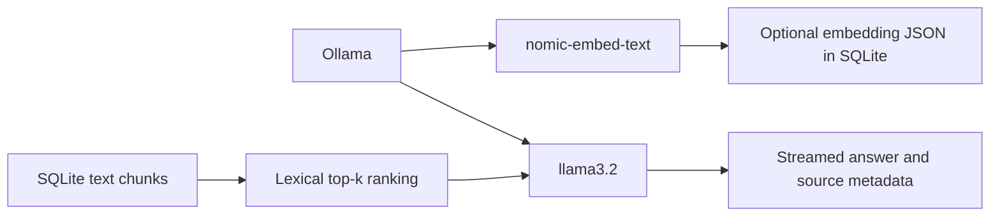
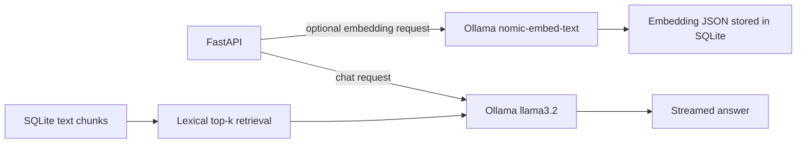

## Quick start

Windows (PowerShell):

```powershell
irm https://raw.githubusercontent.com/veer-bajpai/FRIDAY-Local-First-AI-Knowledge-Assistant/main/install.ps1 | iex
```

macOS / Linux:

```bash
curl -fsSL https://raw.githubusercontent.com/veer-bajpai/FRIDAY-Local-First-AI-Knowledge-Assistant/main/install.sh | bash
```

Then open a new terminal:

```sh
friday
friday chat
friday chat -p "question"
friday setup
friday update
friday --no-open
friday --help
```

`friday` starts the web UI; `friday chat` uses the same backend history and documents. Setup installs Git, Node.js, Python, Ollama, and the `llama3.2` and `nomic-embed-text` models.

Terminal chat commands: `/new`, `/history`, `/resume <n>`, `/docs`, `/status`, `/sources on|off`, `/k <1-20>`, `/clear`, `/help`, `/exit`.

Data is stored in `~/.friday/data` (override with `FRIDAY_DATA_DIR`).

Requirements: Git, Node.js 20+, Python 3.11+ (the Windows installer installs Python 3.12), and Ollama for model-backed chat and embeddings. The installer sets up Ollama and pulls `llama3.2` and `nomic-embed-text`.

The Windows installer requires `winget`; macOS uses Homebrew; Linux supports `apt`, `dnf`, or `pacman` (and `sudo` when system packages need elevated installation). First setup needs an internet connection and several gigabytes of free space for npm/Python packages and model downloads. The installer scripts must be committed to the repository's `main` branch before the raw GitHub commands above can work.

## Install directly from GitHub

After the installer files are published on `main`, a new Windows machine can install FRIDAY from Command Prompt with:

```cmd
powershell -NoProfile -ExecutionPolicy Bypass -Command "irm 'https://raw.githubusercontent.com/veer-bajpai/FRIDAY-Local-First-AI-Knowledge-Assistant/main/install.ps1' | iex"
```

The script uses `winget` to install Git, Node.js 20+, Python 3.12, and Ollama. It then clones the repository into `%USERPROFILE%\\.friday\\app`, creates `%USERPROFILE%\\.friday\\bin\\friday.cmd`, installs frontend and backend dependencies, builds Next.js, and downloads the configured Ollama models. Open a new terminal after installation so the user PATH update is loaded.

For a local checkout, run the same setup without cloning:

```powershell
Set-ExecutionPolicy -Scope Process -ExecutionPolicy Bypass
.\\install.ps1
```

The installer is not an offline bundle: dependencies and AI models are downloaded during setup. `winget` must already be available through Windows App Installer.

See [Architecture](docs/architecture.md) for the implemented service boundaries, startup sequence, data flows, API routes, deployment modes, and current retrieval limitations. See [Backend guide](backend/README.md) for direct API development.

# FRIDAY: Local-First AI Developer & Knowledge Assistant

<p align="center">
  <strong>F.R.I.D.A.Y.</strong><br/>
  <em>Fast Retrieval, Intelligent Dialogue & Autonomous Yield</em>
</p>

<p align="center">
   A local-first AI workspace for conversational assistance, document search, document intelligence, and retrieval-augmented generation.
</p>

<p align="center">
   
  
  
  
   
  
</p>

---

## 🧠 What is Friday?

**Friday** is a local-first personal AI workspace designed to combine conversational AI with document intelligence and lexical retrieval.

Instead of treating an AI assistant as only a chat window, Friday is designed as a complete knowledge workspace where users can:

- 💬 Chat with a local AI assistant
- 📄 Upload and manage documents
- 🔎 Search indexed document chunks
- 🧠 Retrieve relevant document context
- 📚 Ground AI responses in user-provided sources
- 📊 Inspect assistant activity
- 🕘 Access conversation history
- ⚙️ Configure retrieval and model settings
- 🔒 Keep sensitive knowledge inside the local environment

The application is built around a **frontend → API → retrieval → model** architecture, allowing the user interface and AI engine to evolve independently.

## Local services

The CLI runs the Next.js frontend at `http://localhost:3000` and FastAPI at `http://localhost:8000`. Ollama normally listens at `http://localhost:11434`. Run `friday setup` once to install dependencies, build the frontend, start/check Ollama, and pull configured models; subsequent `friday` starts reuse cached setup. The CLI stores its SQLite database and uploads under `~/.friday/data` by default.

Useful commands:

| Command                     | Behavior                                                     |
| --------------------------- | ------------------------------------------------------------ |
| `friday`                    | Start backend and web client; open the browser               |
| `friday --no-open`          | Start services without opening a browser                     |
| `friday chat`               | Interactive terminal chat using the shared backend history   |
| `friday chat -p "question"` | Ask one question and exit                                    |
| `friday setup`              | Install/cache dependencies, build, and prepare Ollama models |
| `friday update`             | Fast-forward the CLI checkout and invalidate setup stamps    |

Terminal chat supports `/new`, `/history`, `/resume <n|id>`, `/docs`, `/status`, `/sources on|off`, `/k <1-20>`, `/clear`, `/help`, and `/exit`. Banner options: `FRIDAY_THEME=gray|blue|green|red` (gray by default), `FRIDAY_MASCOT=0`, `FRIDAY_NO_BANNER=1`; `NO_COLOR` and non-TTY output also suppress the banner. The mascot is skipped below 80 columns, and rendered without color when fewer than 256 colors are available.

### Image uploads

The chat composer includes a dedicated photo picker and rejects non-image selections in that picker. The backend currently accepts raster uploads but does not OCR or interpret image pixels; image files do not yield searchable text. The separate document upload flow supports PDF text extraction and UTF-8 text-like files such as Markdown, TXT, and CSV.

---

# ✨ Core Capabilities

### 💬 AI Conversation Workspace

Friday provides a modern conversational interface for interacting with the assistant.

Features include:

- Real-time chat composer
- User and assistant message states
- Conversation context
- Source references
- Model information
- Retrieval configuration
- Responsive desktop/mobile interface
- Local assistant status

The frontend communicates with the FastAPI service through REST endpoints.

---

### 📚 Document Intelligence

Friday is designed around a document-aware assistant rather than a generic chatbot.

The current document pipeline provides:

```text
Document
   ↓
Text extraction
   ↓
Chunking
   ↓
Optional Ollama embedding generation
   ↓
SQLite chunk storage
   ↓
Lexical chunk ranking
   ↓
Relevant context
   ↓
LLM
   ↓
Grounded response
```

Documents can become searchable knowledge sources for future conversations.

---

### 🔎 Search and retrieval

The current search implementation uses lexical token overlap, not semantic/vector similarity.

For example:

```text
Query:
"How does the system find similar documents?"

        ↓

Token overlap ranking

        ↓

Relevant document chunks
```

Chunks are ranked by the share of unique query tokens they contain, then filtered by the configured maximum distance and limited to the requested top-k count. Embeddings are stored when available but are not used by the current retrieval function.

---

### 🧠 Retrieval-Augmented Generation

Friday follows a RAG-oriented architecture:

```text
User Question
      │
      ▼
Query Processing
      │
      ▼
   Lexical Chunk Ranking
      │
      ▼
Top-K Relevant Chunks
      │
      ▼
Context Assembly
      │
      ▼
Local LLM
      │
      ▼
Grounded Answer + Sources
```

The backend exposes configurable retrieval count (`k`), collection filtering, and source metadata. Ollama provides optional embedding generation during ingestion and the generation model for chat.

---

# 🏗️ System Architecture

## High-Level Architecture



The browser and terminal chat share the same FastAPI service and storage. The current retrieval algorithm is lexical token-overlap ranking; embeddings are stored when Ollama returns them, but no vector index is implemented. See [docs/architecture.md](docs/architecture.md) for component details, API routes, schema, and request sequences.

---

# 🔬 Retrieval Architecture

Friday's current retrieval layer ranks indexed chunks with a lightweight lexical scorer. Embeddings are generated during ingestion when Ollama is available and are stored with the chunk for future vector retrieval work.

```text
                         Query
                           │
                           ▼
              ┌─────────────────────────┐
              │      Retrieval Layer    │
              └────────────┬────────────┘
                           │
                           ▼
                 ┌──────────────────┐
                 │ Lexical Ranking  │
                 └────────┬─────────┘
                           │
                           ▼
                    Top-K Chunks
                           │
                           ▼
                    Context Builder
                           │
                           ▼
                         LLM
```

The product UI exposes retrieval count and maximum distance settings. The current backend uses lexical ranking; stored embeddings provide the extension point for a future vector index.

---

# 🧩 Application Architecture

Friday is separated into independent application layers.

```text
Browser or terminal CLI
        │ REST / SSE
        ▼
     FastAPI API ─────── Ollama (optional embeddings and chat)
        │
        ├── SQLite: settings, documents, chunks, conversations, activity
        └── Filesystem: uploaded source files
```

This separation makes it possible to replace individual components without rebuilding the entire application.

---

# 🖥️ Frontend Architecture

The frontend is built with:

- **Next.js**
- **React**
- **TypeScript**
- **Lucide React**
- **CSS**

The main workspace currently provides navigation for:

```text
┌─────────────────────────────┐
│ Friday                      │
├─────────────────────────────┤
│ + New conversation          │
│                             │
│ 💬 Chat                     │
│ 📄 Documents                │
│ ⚡ Activity                 │
│ 🗄 History                  │
│                             │
│ Workspace                   │
│ 📁 My Library               │
│ ▦ Collections               │
│                             │
│ Local Engine                │
│ ⚙ Settings                 │
└─────────────────────────────┘
```

The main interface also contains:

- Conversation workspace
- Context panel
- Attached sources
- Model selector
- Retrieval settings
- Document upload surface
- Responsive mobile navigation

The current frontend sends requests to `NEXT_PUBLIC_API_URL`, defaulting to the local FastAPI server at `http://localhost:8000`. Chat uses the streaming endpoint so generated tokens render as they arrive.

---

# ⚙️ Backend Architecture

The backend is implemented using **FastAPI**.

Current API boundary:

| Endpoint                                        | Method             | Purpose                                                   |
| ----------------------------------------------- | ------------------ | --------------------------------------------------------- |
| `/health`, `/`                                  | GET                | Health and service metadata                               |
| `/api/status`, `/api/models`                    | GET                | Ollama/model and document status; available Ollama models |
| `/api/settings`                                 | GET, PUT           | Read or update assistant and retrieval settings           |
| `/api/documents`                                | GET                | List documents                                            |
| `/api/documents/upload`                         | POST               | Upload and schedule background ingestion                  |
| `/api/documents/{id}`                           | GET, DELETE        | Read or delete a document                                 |
| `/api/search`                                   | POST               | Search chunks using lexical ranking                       |
| `/api/chat`, `/api/chat/stream`                 | POST               | Non-streaming or SSE chat                                 |
| `/api/conversations`                            | GET, POST          | List or create conversations                              |
| `/api/conversations/{id}`                       | GET, PATCH, DELETE | Read, rename, or delete a conversation                    |
| `/api/collections`                              | GET, POST          | List or create collections                                |
| `/api/collections/{id}`                         | PATCH, DELETE      | Rename or delete a collection                             |
| `/api/collections/{id}/documents/{document_id}` | POST, DELETE       | Associate or dissociate a document                        |
| `/api/activity`                                 | GET                | Read recent activity                                      |

Pydantic validates chat/search input lengths and numeric ranges. File ingestion extracts PDF or text content; raster images currently have no OCR or image-understanding path.

---

# 🤖 Local AI Stack

Friday is designed to support local AI through **Ollama**.

### Embedding Model

```text
nomic-embed-text
```

Used for transforming text into vector representations.

### Generation Model

```text
llama3.2
```

Used as the local language model for generating responses from retrieved context.

Current model responsibilities:



Stored embeddings are not used by the current search or chat retrieval algorithm.

The repository's defaults specify both models as the intended local RAG stack. If Ollama is unavailable, document ingestion still completes and the API remains usable for non-generation features.

---

# 📁 Project Structure

```text
FRIDAY/
│
├── bin/
│   ├── banner.js
│   ├── chat.js
│   └── friday.js
│
├── .github/
│   └── workflows/
│       └── ci.yml
│
├── backend/
│   ├── app/
│   │   ├── __init__.py
│   │   └── main.py
│   │
│   ├── Dockerfile
│   ├── requirements.txt
│   └── README.md
│
├── docs/
│   └── architecture.md
│
├── public/
│   ├── file.svg
│   ├── friday-preview.svg
│   ├── globe.svg
│   ├── next.svg
│   ├── vercel.svg
│   └── window.svg
│
├── src/
│   └── app/
│       ├── favicon.ico
│       ├── globals.css
│       ├── layout.tsx
│       ├── login/
│       │   └── page.tsx
│       └── page.tsx
│
├── .env.example
├── docker-compose.yml
├── Dockerfile
├── .gitignore
├── AGENTS.md
├── CLAUDE.md
├── eslint.config.mjs
├── next.config.ts
├── package-lock.json
├── package.json
├── postcss.config.mjs
├── tsconfig.json
└── README.md
```

---

# 🔄 Request Lifecycle

## Chat Request

```text
1. User enters a question
             │
             ▼
2. Next.js chat interface
             │
             ▼
3. POST /api/chat/stream
             │
             ▼
4. FastAPI validates request
             │
             ▼
5. Retrieval layer finds relevant context
             │
             ▼
6. Context is passed to local LLM
             │
             ▼
7. LLM generates response
             │
             ▼
8. API streams tokens and returns sources
             │
             ▼
9. Friday renders the response
```

---

# 📄 Document Request Lifecycle

```text
User
 │
 │ Upload document
 ▼
Next.js
 │
 │ multipart/form-data
 ▼
FastAPI
 │
 ▼
Document ingestion
 │
 ▼
Text extraction
 │
 ▼
Chunking
 │
 ▼
Optional embedding generation
 │
 ▼
SQLite chunk text and optional embedding JSON
 │
 ▼
Lexical token-overlap ranking
 │
 ▼
Context for search and chat
```

---

# 🛠️ Tech Stack

## Frontend

| Technology   | Purpose                        |
| ------------ | ------------------------------ |
| Next.js      | Web application framework      |
| React        | UI component architecture      |
| TypeScript   | Type-safe frontend development |
| Lucide React | UI icons                       |
| CSS          | Responsive product interface   |

## Backend

| Technology | Purpose                 |
| ---------- | ----------------------- |
| Python     | Backend language        |
| FastAPI    | REST API framework      |
| Pydantic   | Request validation      |
| Uvicorn    | ASGI development server |

## AI / Retrieval

| Technology         | Purpose                                                                         |
| ------------------ | ------------------------------------------------------------------------------- |
| Ollama             | Local model runtime                                                             |
| `nomic-embed-text` | Optional chunk embeddings stored with content; not used for retrieval currently |
| `llama3.2`         | Chat generation                                                                 |
| SQLite             | Persistent conversations, documents, chunks, settings, and activity             |
| Lexical ranking    | Current chunk search and retrieval                                              |

## Engineering

| Technology     | Purpose                     |
| -------------- | --------------------------- |
| Git            | Version control             |
| GitHub         | Source hosting              |
| GitHub Actions | CI automation               |
| npm            | Frontend package management |
| Python venv    | Backend isolation           |

---

# 🚀 Getting Started

## Requirements

Required to run the CLI and local application:

- Node.js 20+
- npm (ships with Node.js)
- Python 3.11+
- Git
- Ollama for model-backed chat and embedding generation

The one-line installers install/check Git, Node.js, Python, and Ollama, then prepare the app and pull the default models. The Windows installer targets Python 3.12; the launcher accepts Python 3.11 or newer.

The defaults are `llama3.2:latest` for generation and `nomic-embed-text:latest` for embeddings. The web API can serve non-model features without Ollama, but chat generation requires an available Ollama model.

---

## 1. Clone the repository

```bash
git clone https://github.com/veer-bajpai/FRIDAY-Local-First-AI-Knowledge-Assistant.git
cd FRIDAY-Local-First-AI-Knowledge-Assistant
```

---

## 2. Install frontend dependencies

```bash
npm install
```

---

## 3. Configure environment

### Windows PowerShell

```powershell
Copy-Item .env.example .env.local
```

### macOS / Linux

```bash
cp .env.example .env.local
```

Set the frontend API URL in `.env.local` for Next.js development:

```env
NEXT_PUBLIC_API_URL=http://localhost:8000
```

The CLI passes runtime environment variables to the frontend and backend. It defaults `FRIDAY_DATA_DIR` to `~/.friday/data` and `OLLAMA_URL` to `http://localhost:11434`. The backend itself does not load `.env` files; set backend variables in the launching shell when running Uvicorn manually.

---

# 🐍 Start the Backend

Create a virtual environment:

```powershell
python -m venv .venv
```

Activate it:

```powershell
.\.venv\Scripts\Activate.ps1
```

Install dependencies:

```powershell
pip install -r backend/requirements.txt
```

Start FastAPI from the backend package directory:

```powershell
Push-Location backend
uvicorn app.main:app --reload --port 8000
Pop-Location
```

Backend:

```text
http://localhost:8000
```

Health check:

```text
http://localhost:8000/health
```

API documentation:

```text
http://localhost:8000/docs
```

---

# ⚛️ Start the Frontend

Open another terminal:

```powershell
npm run dev
```

Open:

```text
http://localhost:3000
```

For a production-style local run after `npm run build`, use `npm run start`. The project uses standalone output, so `node .next/standalone/server.js` is the equivalent direct command.

---

# 🐳 Run with Docker Compose

Docker Desktop must be running before starting the full stack:

```powershell
docker compose up --build
```

This starts Ollama, FastAPI, and Next.js together. Open `http://localhost:3000`; the API is available at `http://localhost:8000` and Ollama at `http://localhost:11434`.

Stop the stack with:

```powershell
docker compose down
```

The Compose volume keeps Ollama models, while the bind-mounted `data/` directory keeps the Friday database and uploads.

---

# 🦙 Enable Local AI

Install Ollama and download the models:

```bash
ollama pull nomic-embed-text
ollama pull llama3.2
```

Verify:

```bash
ollama list
```

Current local model responsibilities:



---

# 🧪 Validation

Run frontend linting:

```bash
npm run lint
```

Build the production frontend:

```bash
npm run build
```

Validate Python syntax:

```bash
python -m compileall backend
```

---

# 🔐 Privacy Model

Friday is designed around a **local-first AI architecture**.

When configured with Ollama:

```text
User
 │
 ▼
Friday UI
 │
 ▼
Local FastAPI
 │
 ▼
Local Retrieval
 │
 ▼
Local Ollama
 │
 ▼
Local Response
```

The goal is to allow personal documents and knowledge to remain within the user's own environment rather than requiring every interaction to be sent to a hosted AI provider.

> Local execution depends on how the application is configured and which external services are enabled.

---

# 🧱 Engineering Principles

Friday follows several architectural principles.

### 1. Separation of concerns

```text
UI ≠ API ≠ Retrieval ≠ Model
```

Each layer should have a clear responsibility.

### 2. Model independence

The frontend should not depend directly on a particular LLM provider.

Instead:

```text
Frontend
   ↓
API
   ↓
AI abstraction
   ↓
Model provider
```

This makes it possible to change models without redesigning the application.

### 3. Retrieval-first AI

Instead of asking the model to remember everything:

```text
Question
   ↓
Retrieve relevant knowledge
   ↓
Give context to model
   ↓
Generate answer
```

### 4. Source-aware responses

RAG responses should retain the relationship between:

```text
Answer
  ↕
Retrieved context
  ↕
Original document
```

This makes responses easier to inspect and validate.

---

# 🗺️ Roadmap

## Phase 1 — Foundation

- [x] Next.js application
- [x] Responsive assistant interface
- [x] Login screen
- [x] Chat workspace
- [x] Documents view
- [x] Activity view
- [x] History view
- [x] FastAPI backend
- [x] Health endpoint
- [x] Document API
- [x] Search API boundary
- [x] Chat API boundary

## Phase 2 — Retrieval Engine

- [x] Document ingestion
- [x] PDF, Markdown, text, CSV, and image uploads
- [x] Text chunking
- [x] Optional Ollama embedding pipeline
- [x] SQLite persistence
- [x] Retrieval API
- [ ] Persistent vector index
- [ ] Retrieval benchmarking

## Phase 3 — RAG

- [x] Context assembly
- [x] Top-K retrieval
- [x] Prompt construction
- [x] Source metadata in API responses
- [x] Streaming responses
- [ ] Citation rendering in the UI
- [ ] Context-window optimization
- [ ] Hallucination reduction

## Phase 4 — Personal Memory

- [x] Conversation persistence
- [ ] Long-term memory
- [x] Model and retrieval settings
- [x] Document collections
- [ ] Conversation search

## Phase 5 — Developer Agent

- [ ] Repository ingestion
- [ ] Codebase indexing
- [ ] Semantic code search
- [ ] File-aware context
- [ ] Code understanding
- [ ] Tool calling
- [ ] Terminal integration
- [ ] Git integration
- [ ] Agentic workflows

## Phase 6 — Production

- [ ] Authentication
- [ ] Persistent database
- [ ] Background processing
- [ ] Streaming responses
- [ ] Observability
- [ ] Rate limiting
- [ ] Secure file handling
- [x] Local Docker Compose deployment
- [ ] Production CI/CD

---

# 🎯 Long-Term Vision

Friday is intended to evolve from a **local AI chat interface** into a complete personal AI system.

```text
                    ┌─────────────────────┐
                    │       FRIDAY        │
                    │   Personal AI OS    │
                    └──────────┬──────────┘
                               │
       ┌───────────────────────┼────────────────────────┐
       │                       │                        │
       ▼                       ▼                        ▼
 ┌───────────┐          ┌─────────────┐          ┌─────────────┐
 │ Knowledge │          │ Conversation│          │ Developer   │
 │   Engine  │          │    Engine   │          │   Agent     │
 └─────┬─────┘          └──────┬──────┘          └──────┬──────┘
       │                       │                        │
       ▼                       ▼                        ▼
 Documents                Memory                  Codebases
 Embeddings               History                 Repositories
 Vector Search             Context                 Tools
 RAG                       Personas                Automation
       │                       │                        │
       └───────────────────────┼────────────────────────┘
                               │
                               ▼
                       ┌───────────────┐
                       │ Local Models  │
                       │    Ollama     │
                       └───────────────┘
```

The ultimate goal is to build an assistant that can understand a user's **documents, conversations, knowledge, and software projects** while keeping the core intelligence locally controllable.

---

# 🤝 Contributing

Contributions, ideas, bug reports, and architecture discussions are welcome.

```bash
git checkout -b feature/your-feature
git add .
git commit -m "Add your feature"
git push origin feature/your-feature
```

Then open a pull request.

---

# 📜 License

MIT License.

See the `LICENSE` file for details.

---

# 👨‍💻 Author

**Veer Bajpai**

GitHub:
https://github.com/veer-bajpai

Project:
https://github.com/veer-bajpai/FRIDAY-Local-First-AI-Knowledge-Assistant

---

<p align="center">
  <strong>FRIDAY</strong><br/>
   <em>Local intelligence. Searchable knowledge. One workspace.</em>
</p>
