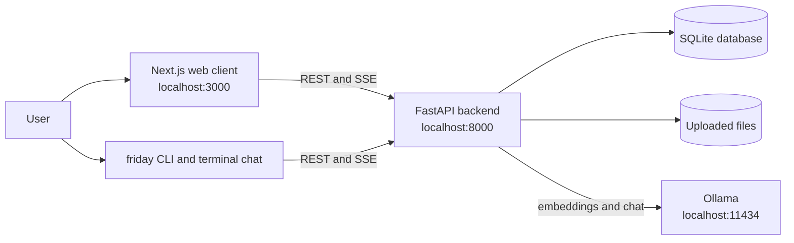
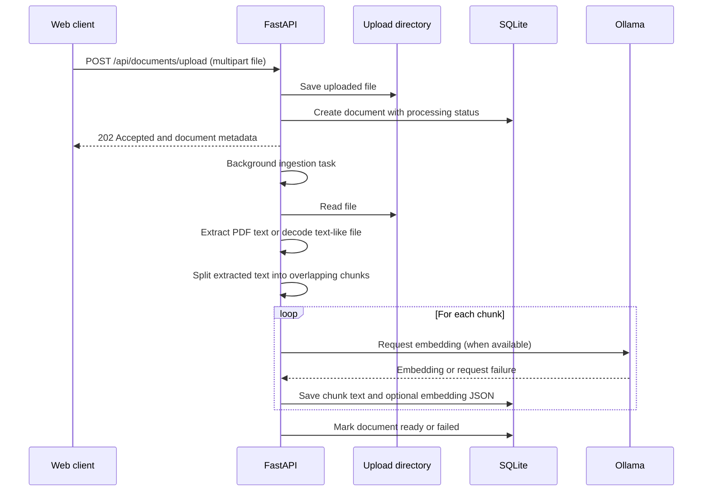

# FRIDAY Architecture

This document describes the implementation in this repository. It distinguishes current behavior from extension points so planned vector search is not mistaken for an implemented feature.

## Working model

FRIDAY is a local application made of three runtime services and two clients:

| Part               | Default address          | Responsibility                                                                           |
| ------------------ | ------------------------ | ---------------------------------------------------------------------------------------- |
| Next.js web client | `http://localhost:3000`  | Workspace UI, uploads, chat rendering, history, collections, and settings                |
| FastAPI backend    | `http://localhost:8000`  | API, SQLite persistence, document ingestion, lexical retrieval, and Ollama orchestration |
| Ollama             | `http://localhost:11434` | Local chat generation and optional ingestion embeddings                                  |
| Browser client     | Uses web client          | Calls the backend over REST and SSE                                                      |
| Terminal client    | `friday chat`            | Calls the same backend and shares the same conversations and documents                   |

The recommended operational path is:

1. Install from the `main` branch using `install.ps1` or `install.sh`.
2. Run `friday setup` once. This installs npm and Python dependencies, builds the frontend, starts/checks Ollama, and pulls `llama3.2` plus `nomic-embed-text`.
3. Run `friday browser` for the web UI or `friday chat` for terminal chat.
4. The launcher starts the backend and production Next.js server, waits for the frontend, and opens the browser unless `--no-open` is used.
5. Stop the managed services with `Ctrl+C`. Data remains under `~/.friday/data` unless `FRIDAY_DATA_DIR` is set.

The direct GitHub installer only works after the installer and launcher files have been committed to the repository's `main` branch. It is a bootstrap script, not a packaged executable or offline installer.

## System Context



The frontend and terminal client use the same API and persistent data. The backend owns document ingestion, lexical retrieval, conversation persistence, settings, collections, and Ollama requests. The launcher is an operational layer around these components; it does not provide a second API or separate terminal-chat store.

## Runtime Components

### Web client

- Next.js App Router application under `src/app/`.
- The main workspace in `src/app/page.tsx` calls the FastAPI API using `NEXT_PUBLIC_API_URL`; for local browser use it falls back to `http://localhost:8000`.
- Chat uses `POST /api/chat/stream` and renders server-sent events (SSE) as tokens arrive.
- The UI includes chat, document upload, activity, conversation history, collections, and settings views.

### CLI and launcher

- `bin/friday.js` is a dependency-free CommonJS launcher requiring Node.js 20+.
- `friday setup` installs npm and backend dependencies, builds the frontend, starts/checks Ollama, and pulls missing configured models.
- `friday` starts Ollama if installed but not responding, then starts Uvicorn and the Next.js production server on ports 8000 and 3000. It opens the browser unless `--no-open` is supplied.
- `friday chat` connects to the running backend when available. If the backend is stopped, it starts a temporary backend for the session. `friday chat -p "question"` sends one question and exits.
- The terminal client in `bin/chat.js` streams the same `/api/chat/stream` events and reads/writes the same conversations as the web client.
- `friday update` runs `git pull --ff-only` and clears the setup stamps so dependencies/build can be refreshed.
- Setup state is stored in `~/.friday/state.json`; the CLI virtual environment is `~/.friday/venv`.
- The banner is implemented in `bin/banner.js`. `FRIDAY_THEME` selects the dark mascot palette; `FRIDAY_MASCOT=0` hides the mascot; `FRIDAY_NO_BANNER=1` disables the banner. The mascot is skipped below 80 columns and rendered without color when fewer than 256 colors are available. The banner is also suppressed for non-TTY output and when `NO_COLOR` is set. One-shot chat and `friday update` do not print the banner.

### API and persistence

- `backend/app/main.py` defines the FastAPI application and initializes the SQLite schema.
- The database path is `<FRIDAY_DATA_DIR>/friday.db`. Uploaded files are placed in `<FRIDAY_DATA_DIR>/uploads/`.
- Without `FRIDAY_DATA_DIR`, the backend uses `./data` relative to its working directory. The CLI sets the default to `~/.friday/data` so web and terminal sessions share data.
- SQLite tables store conversations, messages, documents, chunks, activity, collections, collection/document associations, and settings.

## Data and Request Flows

### Document ingestion



PDF text is extracted with `pypdf`. Other non-image files are read as UTF-8 with invalid bytes ignored. Raster image uploads are accepted, but the current ingestion code does not perform OCR or image understanding; they do not become searchable text. Embedding failures do not prevent text chunks from being stored.

### Search and retrieval

Current search is lexical, not vector similarity search:

1. Select ready chunks, optionally constrained to a collection.
2. Tokenize the query and each chunk and calculate the proportion of unique query tokens found in that chunk.
3. Sort by score, apply the configured distance filter, and return up to `k` snippets with document metadata.

Embeddings are requested during ingestion and stored in the `chunks.embedding` column when Ollama responds. The current `retrieve()` implementation does not query those embeddings and there is no persistent vector index (HNSW, KD-tree, or otherwise) in this repository. Vector retrieval is a future extension point.

### Chat

```mermaid
sequenceDiagram
    participant Client as Web or terminal client
    participant API as FastAPI
    participant DB as SQLite
    participant Ollama

    Client->>API: POST /api/chat/stream
    API->>DB: Read settings, conversation, and recent messages
    API->>DB: Retrieve lexical top-k chunks
    API->>API: Assemble system prompt, history, sources, and question
    API->>Ollama: POST /api/chat with streaming enabled
    loop Model output
        Ollama-->>API: JSON line containing a token
        API-->>Client: SSE data event containing token
    end
    API->>DB: Persist user and assistant messages; update conversation
    API-->>Client: SSE done event with conversation_id and sources
```

The backend retains up to eight recent messages and bounds their combined content to 6,000 characters before sending them to Ollama. The non-streaming `POST /api/chat` endpoint follows the same retrieval and prompt assembly path. Chat requires an available Ollama generation model; the backend returns an error event/fallback when Ollama cannot be reached.

## API Surface

| Method                   | Path                                                       | Purpose                                                           |
| ------------------------ | ---------------------------------------------------------- | ----------------------------------------------------------------- |
| `GET`                    | `/health`                                                  | Health check                                                      |
| `GET`                    | `/`                                                        | Service metadata and docs path                                    |
| `GET`                    | `/api/status`                                              | Ollama availability, configured models, and document count        |
| `GET`                    | `/api/models`                                              | Ollama model list, or an empty list if unavailable                |
| `GET`, `PUT`             | `/api/settings`                                            | Read or update model, retrieval, temperature, and prompt settings |
| `GET`                    | `/api/documents`                                           | List documents and processing status                              |
| `POST`                   | `/api/documents/upload`                                    | Upload a file and schedule ingestion; returns `202`               |
| `GET`, `DELETE`          | `/api/documents/{document_id}`                             | Read or delete a document                                         |
| `POST`                   | `/api/search`                                              | Lexically rank indexed chunks                                     |
| `POST`, `GET`            | `/api/conversations`                                       | Create or list conversations                                      |
| `GET`, `PATCH`, `DELETE` | `/api/conversations/{conversation_id}`                     | Read, rename, or delete a conversation                            |
| `GET`                    | `/api/activity`                                            | List recent activity events                                       |
| `GET`, `POST`            | `/api/collections`                                         | List or create collections                                        |
| `PATCH`, `DELETE`        | `/api/collections/{collection_id}`                         | Rename or delete a collection                                     |
| `POST`, `DELETE`         | `/api/collections/{collection_id}/documents/{document_id}` | Add or remove a document association                              |
| `POST`                   | `/api/chat`                                                | Non-streaming chat                                                |
| `POST`                   | `/api/chat/stream`                                         | Streaming chat using SSE (`token`, `error`, `done`)               |

FastAPI's generated reference is available at `http://localhost:8000/docs` while the backend is running.

## Deployment Topologies

### CLI-managed local services

The CLI runs the frontend and backend as local processes. Ollama is detected separately; when installed but not running, the CLI attempts to start `ollama serve`. Default ports are 3000 (frontend), 8000 (API), and 11434 (Ollama). The CLI binds the backend to `127.0.0.1`.

### Docker Compose

`docker-compose.yml` defines three containers: Ollama, FastAPI, and Next.js. It maps ports 11434, 8000, and 3000 respectively, persists Ollama models in a named volume, and bind-mounts `./data` for backend data. Compose currently starts Ollama but does not itself pull the required models; pull them with `ollama pull llama3.2` and `ollama pull nomic-embed-text` if absent.

## Configuration

| Variable                 | Used by                    | Default / purpose                                                                               |
| ------------------------ | -------------------------- | ----------------------------------------------------------------------------------------------- |
| `NEXT_PUBLIC_API_URL`    | Next.js                    | API URL; local browser default is `http://localhost:8000`                                       |
| `FRIDAY_DATA_DIR`        | FastAPI and CLI            | Data root for SQLite and uploads; CLI default is `~/.friday/data`                               |
| `OLLAMA_URL`             | FastAPI and CLI            | Ollama API base URL; `http://localhost:11434`                                                   |
| `FRIDAY_MODEL`           | CLI/backend initialization | Generation model; `llama3.2:latest` backend default                                             |
| `FRIDAY_EMBED_MODEL`     | CLI/backend initialization | Embedding model; `nomic-embed-text:latest` backend default                                      |
| `FRIDAY_MAX_TOKENS`      | FastAPI backend            | Maximum generated chat tokens; defaults to `128` for faster responses                           |
| `FRIDAY_ALLOWED_ORIGINS` | FastAPI                    | Comma-separated additional CORS origins; known local and deployed frontend origins are retained |
| `FRIDAY_THEME`           | CLI banner                 | `gray` (default), `blue`, `green`, or `red` dark 256-color mascot ramp                          |
| `FRIDAY_MASCOT`          | CLI banner                 | Set to `0` to hide the avatar                                                                   |
| `FRIDAY_NO_BANNER`       | CLI banner                 | Set to `1` to disable the banner                                                                |
| `NO_COLOR`               | CLI banner                 | Any value disables banner output                                                                |

The launcher reads environment variables from the process environment; it does not load `.env` files itself. Docker Compose declares its own service-specific values.

## Security and Privacy Notes

- Local use keeps API, SQLite data, uploads, and Ollama traffic on the configured machine/network, but deployment configuration determines actual exposure.
- The API currently has no authentication or authorization. Do not expose its ports to an untrusted network without adding appropriate access controls.
- CORS is a browser policy, not authentication.
- Chat prompts and retrieved document text are sent to the configured `OLLAMA_URL`; use a trusted local or explicitly configured Ollama service.
